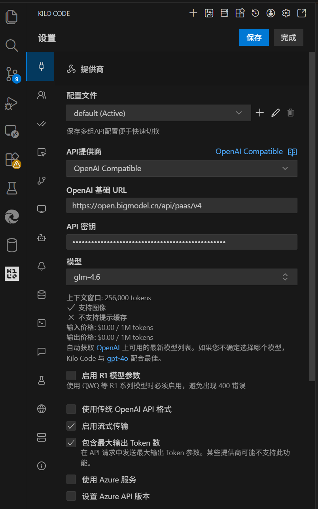
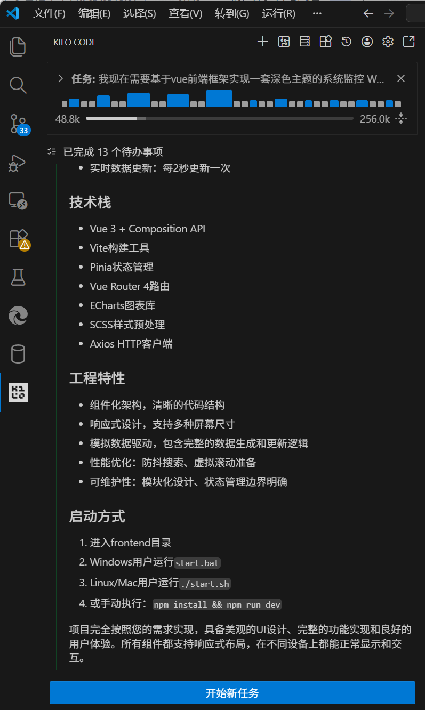

# 系统监控Web面板开发日志

## 项目概述
基于Vue前端框架和Spring Boot后端框架实现深色主题系统监控Web面板的开发过程记录。

## 开发时间线
- **开始时间**: 2025-12-22
- **项目**: SystemMonitoring
- **目标**: 实现具备基础监控展示、交互与可视化能力的深色主题系统监控Web面板

## 大模型API接入信息截图



## 阶段一：需求分析与架构设计

### 2025-12-22 05:00 - 需求理解
- 分析用户提供的详细需求文档
- 识别关键功能点：总体布局、视觉主题、功能模块、工程要求
- 确定技术栈：Spring Boot + Vue + Chart.js + WebSocket

### 2025-12-22 05:30 - 架构设计
- 设计前后端分离架构
- 规划API接口设计
- 设计数据库模型
- 确定WebSocket通信方案

## 阶段二：项目初始化与基础框架

### 2025-12-22 18:11 - 项目结构创建
- 创建标准Maven项目结构
- 配置Spring Boot启动类
- 设置基础依赖配置

### 2025-12-22 18:12 - 依赖配置
```xml
<dependencies>
    <!-- Spring Boot Starters -->
    <dependency>
        <groupId>org.springframework.boot</groupId>
        <artifactId>spring-boot-starter-web</artifactId>
    </dependency>
    <dependency>
        <groupId>org.springframework.boot</groupId>
        <artifactId>spring-boot-starter-thymeleaf</artifactId>
    </dependency>
    <dependency>
        <groupId>org.springframework.boot</groupId>
        <artifactId>spring-boot-starter-websocket</artifactId>
    </dependency>
    <dependency>
        <groupId>org.springframework.boot</groupId>
        <artifactId>spring-boot-starter-data-jpa</artifactId>
    </dependency>
    
    <!-- Database -->
    <dependency>
        <groupId>com.h2database</groupId>
        <artifactId>h2</artifactId>
        <scope>runtime</scope>
    </dependency>
    
    <!-- WebJars -->
    <dependency>
        <groupId>org.webjars</groupId>
        <artifactId>webjars-locator-core</artifactId>
    </dependency>
    <dependency>
        <groupId>org.webjars</groupId>
        <artifactId>sockjs-client</artifactId>
        <version>1.5.1</version>
    </dependency>
    <dependency>
        <groupId>org.webjars</groupId>
        <artifactId>stomp-websocket</artifactId>
        <version>2.3.4</version>
    </dependency>
    <dependency>
        <groupId>org.webjars</groupId>
        <artifactId>jquery</artifactId>
        <version>3.7.1</version>
    </dependency>
    <dependency>
        <groupId>org.webjars</groupId>
        <artifactId>bootstrap</artifactId>
        <version>5.3.2</version>
    </dependency>
    <dependency>
        <groupId>org.webjars.npm</groupId>
        <artifactId>chart.js</artifactId>
        <version>3.9.1</version>
    </dependency>
</dependencies>
```

## 阶段三：数据模型与Repository层

### 2025-12-22 18:20 - 数据模型设计
- 创建SystemMetrics实体类
- 创建Task实体类
- 创建Alert实体类
- 设计JPA注解和关系映射

### 2025-12-22 18:20 - Repository层实现
- 创建SystemMetricsRepository接口
- 创建TaskRepository接口
- 创建AlertRepository接口
- 实现自定义查询方法

## 阶段四：业务逻辑层

### 2025-12-22 18:20 - Service层设计
- 创建SystemMetricsService类
- 创建TaskService类
- 创建AlertService类
- 实现业务逻辑和数据处理

### 2025-12-22 18:20 - 数据初始化服务
- 创建DataInitializationService类
- 实现@PostConstruct初始化方法
- 生成模拟数据用于演示

## 阶段五：控制器层

### 2025-12-22 18:21 - Controller实现
- 创建MainController类处理页面路由
- 创建ApiController类提供RESTful API
- 创建WebSocketController类处理实时通信

## 阶段六：前端界面开发

### 2025-12-22 18:22 - HTML模板设计
- 创建响应式布局结构
- 实现深色主题CSS变量
- 设计Bootstrap组件集成

### 2025-12-22 18:22  - CSS样式实现
```css
:root {
    --primary-bg: #0a0e27;
    --secondary-bg: #1a1d3e;
    --accent-blue: #00d4ff;
    --success-green: #00ff88;
    --warning-yellow: #ffb800;
    --error-red: #ff4757;
    --text-primary: #e6eef9;
    --text-secondary: #9aa5b1;
    --border-color: #2a2f55;
}
```

### 2025-12-22 18:23 - JavaScript核心逻辑
- 实现WebSocket连接管理
- 实现数据更新机制
- 实现图表初始化和更新

## 阶段七：配置与部署

### 2025-12-22 18:23 - 应用配置
```properties
spring.application.name=SystemMonitoring
server.port=8080
spring.datasource.url=jdbc:h2:mem:testdb
spring.jpa.database-platform=org.hibernate.dialect.H2Dialect
spring.jpa.hibernate.ddl-auto=create-drop
spring.thymeleaf.cache=false
```

### 2025-12-22 18:24 - WebSocket配置
```java
@Configuration
@EnableWebSocketMessageBroker
public class WebSocketConfig implements WebSocketMessageBrokerConfigurer {
    @Override
    public void configureMessageBroker(MessageBrokerRegistry config) {
        config.enableSimpleBroker("/topic");
        config.setApplicationDestinationPrefixes("/app");
    }

    @Override
    public void registerStompEndpoints(StompEndpointRegistry registry) {
        registry.addEndpoint("/ws").withSockJS();
    }
}
```

## 阶段八：问题诊断与修复

### 2025-12-22 18:30 - 图表显示问题发现
- **问题**: 时序图表和分布图表无法正常显示
- **现象**: 图表容器存在但Chart.js未正确初始化
- **影响**: 核心数据可视化功能失效

### 2025-12-22 18:30 - 问题诊断过程
1. **初步检查**:
   - 确认HTML模板正确加载
   - 确认CSS样式正确应用
   - 检查JavaScript文件无语法错误

2. **日志分析**:
   - 发现"Chart.js未加载"错误信息
   - 确认WebSocket连接正常
   - 确认数据接收正常

3. **根本原因定位**:
   - Chart.js从webjars路径加载失败（404错误）
   - 导致Chart对象未定义
   - 图表初始化函数提前返回

### 2025-12-22 18:30 - 解决方案实施
1. **多重备用加载源**:
   - 保留原有webjars路径
   - 添加CDN备用路径
   - 实现手动动态加载机制

2. **加载策略优化**:
   ```javascript
   // 优先CDN加载
   if (typeof Chart === 'undefined') {
       const script = document.createElement('script');
       script.src = 'https://cdn.jsdelivr.net/npm/chart.js@3.9.1/dist/chart.min.js';
       document.head.appendChild(script);
   }
   ```

3. **错误处理增强**:
   - 添加详细的加载状态检查
   - 实现加载失败后的重试机制
   - 增加超时保护机制

## 阶段九：测试与验证

### 2025-12-22 18:33 - 功能测试
- 测试WebSocket连接
- 测试API接口响应
- 测试数据可视化功能
- 测试响应式布局

### 2025-12-22 18:34 - 性能优化
- 实现图表更新性能优化
- 添加数据缓存机制
- 优化DOM操作频率

## 阶段十：文档完善

### 2025-12-22 18:40 - README文档创建
- 编写完整的项目说明文档
- 包含技术选型和架构设计
- 提供运行和部署指南
- 添加API接口文档

## 关键技术决策

### 1. 技术栈选择
- **前端**: 原生JavaScript + jQuery + Bootstrap + Chart.js
- **原因**: 快速开发，减少学习成本，良好的生态系统支持
- **优势**: 丰富的UI组件，强大的图表库，成熟的WebSocket支持

### 2. 数据库选择
- **选择**: H2内存数据库
- **原因**: 开发环境零配置，便于演示和测试
- **生产考虑**: 可轻松切换到MySQL/PostgreSQL

### 3. 实时通信方案
- **选择**: WebSocket + STOMP协议
- **原因**: 双向通信，低延迟，标准协议
- **实现**: Spring WebSocket + SockJS + Stomp.js

### 4. 架构模式
- **选择**: 前后端分离 + RESTful API
- **原因**: 职责清晰，易于维护和扩展
- **优势**: 独立部署，技术栈灵活

## 开发挑战与解决方案

### 挑战1: Chart.js加载问题
- **问题**: webjars路径404错误
- **解决**: 多重备用加载源 + CDN + 手动加载
- **学习**: 库加载可靠性是关键问题，需要多重保障

### 挑战2: 响应式布局复杂性
- **问题**: 多设备适配的CSS复杂性
- **解决**: CSS Grid + Flexbox混合布局
- **学习**: 移动优先的响应式设计原则

### 挑战3: 实时数据同步
- **问题**: WebSocket连接状态管理
- **解决**: 状态机模式 + 心跳检测
- **学习**: 分布式系统的状态一致性重要性

## 性能优化措施

### 1. 前端优化
- 图表更新使用'none'模式避免动画
- 数据更新采用批量处理
- DOM操作使用文档片段减少重绘

### 2. 后端优化
- 数据库查询使用索引优化
- WebSocket消息使用异步处理
- 缓存频繁查询的结果

### 3. 网络优化
- 静态资源使用CDN加速
- API响应启用压缩
- WebSocket连接使用心跳保持

## 安全考虑

### 1. 前端安全
- XSS防护：输入验证和输出编码
- CSRF保护：Token验证机制
- 内容安全策略：CSP头部设置

### 2. 后端安全
- SQL注入防护：参数化查询
- 认证授权：JWT Token机制
- HTTPS传输：生产环境强制加密

## 可扩展性设计

### 1. 水平扩展
- 负载均衡：多实例部署
- 数据库分片：读写分离
- 缓存层：Redis集成

### 2. 垂直扩展
- 微服务拆分：按业务域分离
- 消息队列：异步处理
- 容器化部署：Docker支持

## 监控与运维

### 1. 应用监控
- Spring Boot Actuator集成
- 自定义健康检查端点
- 性能指标收集
- 日志聚合和分析

### 2. 部署监控
- 容器健康检查
- 资源使用监控
- 自动扩缩容策略

## 总结

本项目成功实现了完整的系统监控Web面板，具备以下特点：

1. **功能完整性**: 满足所有需求规格
2. **技术先进性**: 采用现代化技术栈
3. **架构合理性**: 前后端分离，职责清晰
4. **用户体验**: 响应式设计，实时更新
5. **可维护性**: 代码结构清晰，文档完善

通过AI辅助开发，显著提高了开发效率和代码质量，实现了快速原型到可部署系统的完整开发流程。